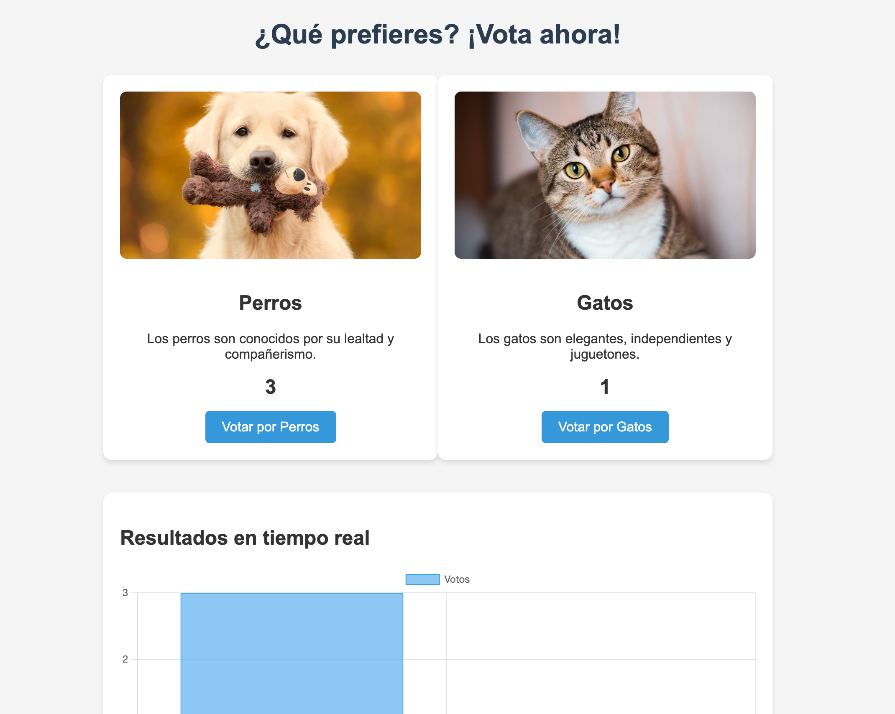

### by RoxsRoss

---

# Despliegues de Aplicaciones en AWS by Roxs

En este README, exploraremos cómo desplegar aplicaciones de manera eficiente en AWS utilizando dos enfoques clave: ECS y entornos locales con Docker y AWS. Esta guía está diseñada para ayudarte a entender los conceptos básicos, pero con la motivación de que, ¡lo que logres hoy es solo el comienzo de lo que puedes construir!

## Despliegue de la Aplicación Voting APP

## 🛠️ Despliegues con Amazon ECS

Amazon ECS (Elastic Container Service) es una solución potente para desplegar y administrar aplicaciones en contenedores. Usar ECS te permite aprovechar al máximo la infraestructura de AWS, gestionando tus contenedores de manera flexible y eficiente.

### Paso 1: Configuración de ECS

1. **Creación del Cluster ECS:**  
   La primera etapa es la creación de un cluster ECS donde se ejecutarán los contenedores. Asegúrate de configurar el entorno adecuado para que puedas gestionar tu infraestructura de manera eficiente.
   
2. **Definir Task Definitions:**  
   Las Task Definitions son la base de tu servicio en ECS. Aquí definirás qué contenedores se ejecutarán, los recursos que necesitan y las configuraciones adicionales como volúmenes y redes.

3. **Desplegar en ECS:**  
   Utiliza las herramientas de AWS CLI o CloudFormation para desplegar tus aplicaciones. Puedes automatizar todo el proceso para asegurar que tus servicios siempre estén disponibles y escalados según la demanda.

Revisa los pasos en [AWS ECS](./docs/ecs.md)

> **Motivación:**  
> "El primer paso hacia el éxito es atreverse a dar el salto. No importa si no tienes todas las respuestas, cada intento es una lección que te acerca más a tu objetivo."

## 🐳 Despliegues Locales con Docker

Si estás comenzando con AWS, probar tu infraestructura localmente con herramientas como Docker  es una excelente forma de experimentar antes de pasar a producción.

Revisa los pasos en [LOCAL](./docs/local.md)

> **Motivación:**  
> "Todo gran logro comienza con un pequeño paso. Da ese primer paso hoy y estarás un paso más cerca de convertir tu idea en realidad."

---

## 🌱 Recursos Adicionales

Aquí hay algunos enlaces útiles y recursos para profundizar más en estos temas:

- [AWS ECS Documentation](https://docs.aws.amazon.com/es_es/AmazonECS/latest/developerguide/Welcome.html)
- [Docker Official Documentation](https://docs.docker.com/)
- [Amazon ECS Workshop](https://ecsworkshop.com/)

---

## 🔥 Enfócate en el Proceso, No Solo en el Resultado

Cada desafío que enfrentes al trabajar con AWS o Docker es una oportunidad para aprender y mejorar. Si te enfrentas a un obstáculo, recuerda: cada error te enseña algo nuevo. Y lo más importante, ¡nunca dejes de intentarlo!

> **Motivación Final:**  
> "No hay una única forma de tener éxito, pero sí hay una sola forma de fallar: no intentarlo. ¡Sigue adelante y hazlo posible!"

> _"DevOps es el arte de la colaboración y la automatización, donde la innovación y la confiabilidad se unen para crear un camino continuo hacia el éxito."_

🔥🔥🔥🔥

## Contactos

Me puedes encontrar en las siguientes plataformas:

- [Hashnode](https://blog.295devops.com)
- [Dev.to](https://dev.to/roxsross)
- [Twitter](https://twitter.com/roxsross)
- [LinkedIn](https://www.linkedin.com/in/roxsross/)
- [Instagram](https://www.instagram.com/roxsross/)
- [YouTube](https://www.youtube.com/channel/UCa-FcaB75ZtqWd1YCWW6INQ)